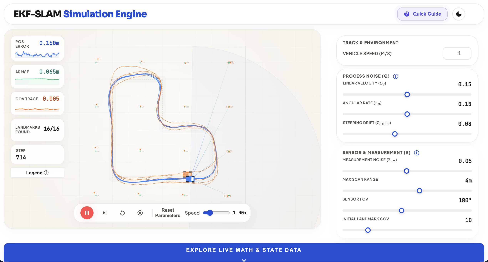
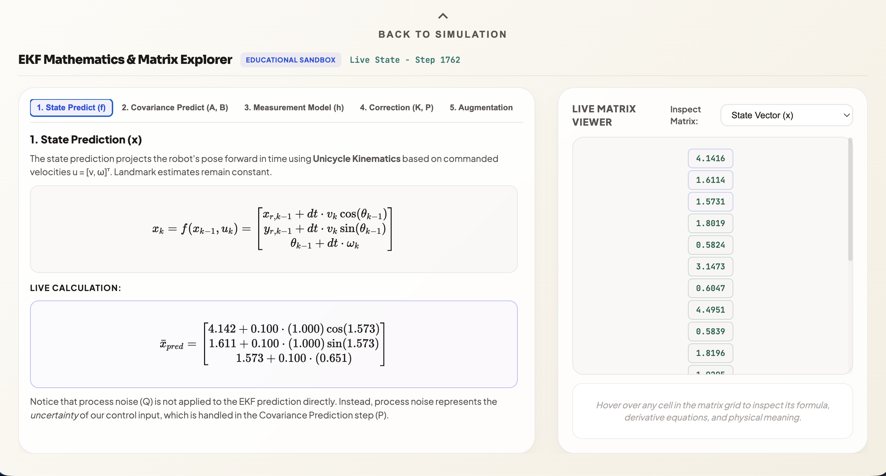
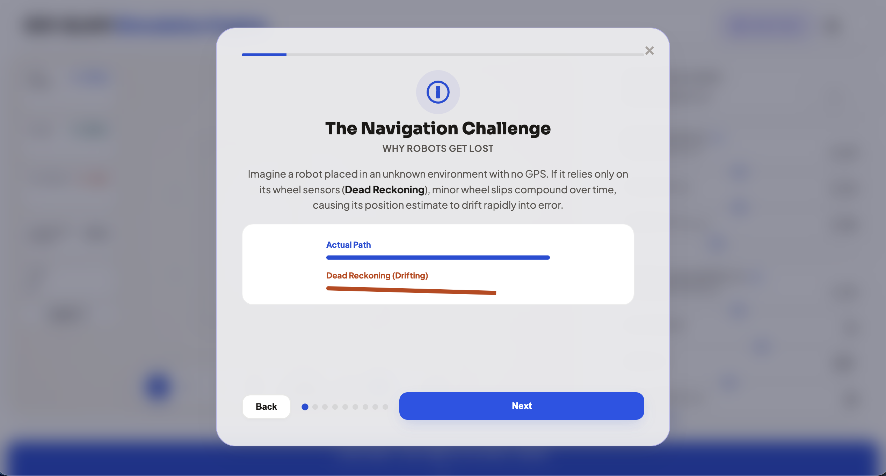

# EKF-SLAM Interactive 2D Simulator

For anyone who's interested in learning about and tinkering with an EKF-SLAM simulator – you're in the right place! This project provides a real-time web-based simulation of the **Extended Kalman Filter for Simultaneous Localization and Mapping (EKF-SLAM)**. Ported and heavily revamped from a MATLAB robotic control codebase (where a hardware implementation was done), this simulator models a ground rover traversing a course, following a track, and detecting landmarks to map its environment and estimate its pose under process and measurement noise.

### 1. Main Simulation Interface


### 2. Live EKF Matrix & State Explorer


### 3. Interactive Educational Onboarding


---

## Core Features (Beyond the Obvious)

*   **Immersive Onboarding & Educational Slides**:
    *   An intentionally designed slide deck that loads on startup explaining the mathematics behind EKF-SLAM (dead reckoning, prediction/correction loops, state vectors, and covariance matrices).
*   **Bilateral Noise Modeling (Gaussian)**:
    *  The EKF only has access to the *commanded* (noisy) inputs, mirroring real-world encoder/odometry limits.
    *  Steering controls are injected with noise to simulate imperfect track-line detection.
    *  Body-frame relative scans of landmarks are corrupted by configurable Gaussian distance and bearing errors.
*   **Live Vector Updates**:
    Real-time transformation of the filter's state vector $x$ and covariance matrix $P$ as new landmarks enter the vehicle's field of view.

---

## Tech Stack & Architectural Decisions

*   **Backend**: Python 3.10+, built using **FastAPI** and **NumPy**. The math of the prediction, update, and state augmentation remains centralized in Python.
*   **Frontend**: Built with **Vite** and **Vanilla Javascript**.
*   **Visualizer**: High-performance **HTML Canvas 2D**.
*   **Custom Charting Engine**: Telemetry sparklines and comparison charts are drawn dynamically using Canvas2D, avoiding external heavy library bundles.

---

## 🚀 Setup & Installation

### 1. Backend Installation (Python)

Ensure you have Astral `uv` installed. If not, install it via:
```bash
curl -LsSf https://astral.sh/uv/install.sh | sh
```

Initialize the environment and install backend dependencies:
```bash
# From the project root (ekf-slam-sim/)
uv venv --python <path_to_your_python_interpreter>
# Install packages
uv pip install -r backend/requirements.txt
```

Run the FastAPI server:
```bash
.venv/bin/uvicorn backend.server:app --reload --port 8000
```

### 2. Frontend Installation (Node.js)

Install Vite and run the dev server:
```bash
# Navigate to the frontend directory
cd frontend
npm install
npm run dev
```

Open your browser at [http://localhost:5173](http://localhost:5173) to see the simulator in action!

---